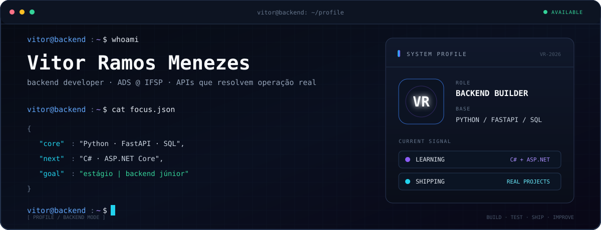
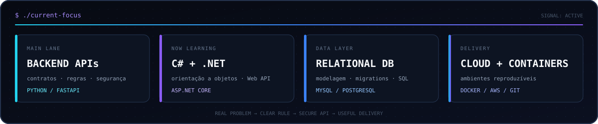
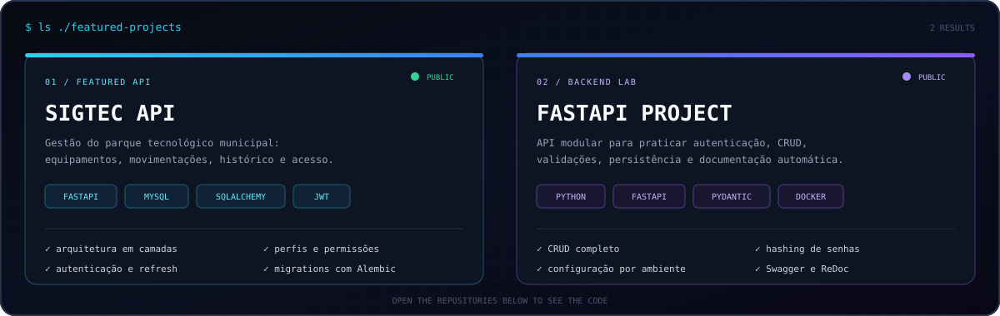

<div align="center">
  
</div>

<p align="center">
  <a href="https://www.linkedin.com/in/vitor-ramos-menezes-a584291b0"></a>
  <a href="https://portfolio-master-nu-beige.vercel.app/"></a>
  <a href="https://github.com/Vitorram"></a>
  
</p>

<div align="center">
  
</div>

<div align="center">
  
</div>

<p align="center">
  <a href="https://github.com/Vitorram/Back-end-Hackthon"><strong>01 / SIGTEC API</strong></a>
  &nbsp;·&nbsp;
  <a href="https://github.com/Vitorram/Api_FastAPI_completo"><strong>02 / FastAPI Project</strong></a>
  &nbsp;·&nbsp;
  <a href="https://portfolio-master-nu-beige.vercel.app/"><strong>Portfólio</strong></a>
</p>

## `./stack`

<p>
  <code>Python</code>
  <code>FastAPI</code>
  <code>SQLAlchemy</code>
  <code>Alembic</code>
  <code>JWT</code>
  <code>C#</code>
  <code>ASP.NET Core</code>
  <code>Java</code>
  <code>JavaScript</code>
  <code>TypeScript</code>
  <code>React</code>
  <code>Next.js</code>
  <code>MySQL</code>
  <code>PostgreSQL</code>
  <code>Docker</code>
  <code>AWS</code>
  <code>Git</code>
</p>

```csharp
public sealed class CurrentFocus
{
    public string Direction => "Backend";
    public string[] BuildingWith => ["Python", "FastAPI", "SQL"];
    public string[] LearningNow => ["C#", "ASP.NET Core"];
    public bool OpenToWork => true;
}
```

<p align="center"><sub>entender o problema · modelar a regra · construir a API · entregar valor</sub></p>
